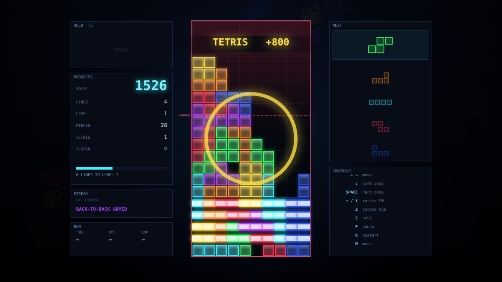

# NEOTRIS

Eleventh game in the harsh-critic-loop series, after
[NEONOID](https://github.com/melvincarvalho/neonoid),
[NEON MINER](https://github.com/melvincarvalho/neonminer),
[NEODROID](https://github.com/melvincarvalho/neodroid),
[NEON DASH](https://github.com/melvincarvalho/neondash),
[NEONLINGS](https://github.com/melvincarvalho/neonlings),
[NEOPOLIS](https://github.com/melvincarvalho/neopolis),
[NEON SCORCH](https://github.com/melvincarvalho/neonscorch),
[NEON MASTER](https://github.com/melvincarvalho/neonmaster),
[NEON ELITE](https://github.com/melvincarvalho/neonelite) and
[NEOCIV](https://github.com/melvincarvalho/neociv) — and the first
deliberately *simple* one. Seven pieces, one well, no mercy: the 7-bag
randomiser, SRS rotation with the full wall-kick tables, hold, ghost,
lock delay with a finite reset budget, T-spins by the three-corner rule,
back-to-back, combos, perfect clears, and the Guideline scoring table
down to the last hard-drop point. Original presentation — Tetris
(Alexey Pajitnov, 1984) and the Guideline it grew into are respected
here, not owned.

**Play it: <https://melvincarvalho.github.io/neotris/>**



**There are no assets.** Every pixel and every sound is generated from
code. Two files: `index.html`, `game.js`. ←→ move, ↓ soft drop, SPACE
hard drop, ↑/X rotate clockwise, Z counter-clockwise, C hold, P pause.

```bash
python3 -m http.server 8000   # or just open index.html
```

## The experiment

Same pipeline as the first ten games — one owner builds, deterministic
`?shot=` captures, four harsh sub-agent critics (three visual lenses
plus a Tetris-fidelity judge), honest scores. The proof harness's next
species: **stacks as theorems.** After empires, voyages and descents, a
game small enough that the whole thing can be proved.

`tools/playtest.sh` proves 19 claims:

- **the stacking bot must survive**: 400 pieces without topping out,
  156 lines, level 16 — and it plays through the *same functions the
  keyboard calls*, rotating and moving and hard-dropping, never
  teleporting a piece into place;
- **and not on one lucky bag**: across ten seeds the bot survives all
  400 pieces **10 times out of 10**, while the null player survives
  **0 of 10** — dying, on average, on the twelfth piece;
- **a player who never steers must LOSE** — dropping every piece where
  it spawns tops out in 12 pieces;
- **ablate-rotation LOSES** (38 pieces): a player who may slide but
  never rotate cannot keep a well;
- **ablate-holes LOSES** (203 pieces): delete only the
  *don't-bury-a-square* term from the bot's judgement and it dies with
  65 lines cleared — buried holes are the thing that actually kills;
- **ablate-height LOSES** (40 pieces): delete the flatness terms and it
  dies almost as fast as no policy at all;
- **13 mechanism proofs** isolate every rule: the 7-bag (100
  consecutive bags, each a permutation of all seven pieces); an SRS
  wall kick (a J flush against the left wall cannot turn in place — the
  first kick shifts it one column in); a **T-spin double that no
  straight drop can achieve** (the harness proves the slot unreachable
  by any column and rotation, then rests, rotates, kicks in, and scores
  exactly 1200); lock delay (survives half a delay, resets on movement,
  and still locks after a finite budget of 16 shuffles); line collapse
  and the blocks that fall into it; the scoring table
  (100/300/500/800, ×3 at level 3, two points per hard-dropped cell);
  back-to-back (800 then 1250 — a 1.5× tetris plus a combo — and a
  plain single breaks the chain); combos (100/150/200, reset by a
  clearless lock); the gravity curve (1.000s at level 1, 0.0642s at
  level 10); hold (stores, refuses a second use, swaps after a lock);
  the ghost landing exactly where a hard drop lands; top-out; and the
  perfect clear.

## Scores

| round | composition | game-feel | HUD | visual mean | Tetris fidelity |
|---|---|---|---|---|---|
| 1 (final) | 4.6 | 6.4 | 5.3 | **5.4** | see note |

Game-feel 6.4 is the highest that critic has given any game in the
series — the bet that a *simple* game concentrates the whole juice
budget onto one screen paid off. Composition disagreed at 4.6:
*"a tidy CSS-developer's wireframe cosplaying as a neon game… 47% of
every frame is unearned black."* Game-feel: *"every juice checkbox is
ticked exactly once and never twice — it flashes hard on the 1-in-20
frames where a line clears and gives you nothing on the other 19."*
HUD: *"a genuinely handsome neon skin wrapped around a HUD that forgets
to tell you how to start, how to restart… and that prints two
different combo numbers on screen at the same instant."*

All three converged on the same diagnosis, and the post-panel batch
answered it. Blocks stopped being hollow outlines and became emissive —
body fill, a top-lit gradient, a glowing stroke — so the game is neon
at rest and not only during a clear. **Every lock** now has weight: a
white impact flash, dust that ejects from the contact row, shake scaled
by drop distance, and a 58Hz thud under the beep, because locking is
what a player does 200 times a session and clearing is what they do 15
times. The audio became a ladder — clear pitch rises a semitone per
combo step and tetrises and T-spins fire a three-note arpeggio — so a
4-combo finally *sounds* different from a single. Banners moved into
the well's empty airspace, gained a gradient plate so the stack can
never win the legibility fight, gained the points they were worth
(`TETRIS +800`), and gained a tier: a single is small and quiet, a
tetris is large with an expanding ring. Floating `+N` popups rise off
the cleared rows. The layout grew from 53% to ~72% of the frame; the
void became a participant with a drifting wireframe field and a glow
behind the well that brightens with level and combo. The field became
readable: a dashed **DANGER** line marks the row that arms the alarm
(whose pulse now quickens as the stack rises), every fifth row is
banded for counting, the active piece lights its own columns, the ghost
became a dashed filled silhouette, and the four blue-violet hues were
pulled apart toward the Guideline seven. And the entry and exit finally
exist: a pulsing PRESS SPACE and a BEST score on the title, a bordered
retry prompt and a run summary on death, an `R` restart key, a LOCKED
badge on a spent hold, and a RUN panel with TIME, PPS and LPM.

All 19 theorems re-verified after every change. The scores above are
the panel's, judged before those fixes.

## Honest assessment

- **One critic round** — the scores are a floor, not a ceiling.
- **This is Guideline Tetris, not 1984 Tetris.** Pajitnov's original
  had no hold, no ghost, no wall kicks, no bag and no lock delay. Every
  modern comfort here is a post-2001 invention, faithfully implemented
  and honestly labelled.
- **The bot never plays for tetrises** (0 in 400 pieces). Its judgement
  rewards any cleared line, so it survives by clearing singles forever.
  It proves the well is *survivable*, not that it is played *well*.
- **The bot cannot spin.** It enumerates rotate-then-translate
  placements only, so no T-spin the human can perform is reachable by
  the machine. The T-spin theorem is proved separately, by hand-built
  slot.
- **No 20G, no line-clear delay, no garbage, no versus** — this is a
  single-player marathon, not a competitive stack.
- Staged evidence shots are separate deterministic runs, not one
  continuous playthrough; the T-spin and combo boards are authored
  positions (the same slot the theorem proves) rather than bot play.
- **The clock refuses to lie.** A bot that hard-drops instantly has no
  wall-clock, so TIME/PPS/LPM render as `—` in any staged shot that was
  not actually timed. The one shot that shows real numbers
  (`shots/level.png`) is a genuine 70-second run stepped at 60Hz with
  the bot throttled to a human cadence — 140 pieces, 2.0 PPS.

## Process notes

1. **Every "tetris" in the test suite was secretly a perfect clear.**
   The first scoring proof reported 2,800 points for a four-line clear
   instead of 800. The tests filled four rows and nothing else, so
   emptying them emptied the board — and the perfect-clear bonus fired
   on top. One block of dirt parked high in the well fixed every
   affected proof at once. The harness was correct; the *questions*
   were wrong.
2. **The lock-delay proof lied because locking works.** It asserted
   "the piece is gone" by checking for a null piece — but a lock
   immediately spawns its successor, so the slot was never null and the
   test concluded the piece had never locked. Tracking the piece by
   identity, not by absence, made it honest.
3. **The T-spin proof carries its own control.** Before spinning, it
   enumerates every column and rotation, drops the T straight down, and
   asserts that *none* of them clears two rows. Only then does it rest
   the piece beside the slot, rotate, and let kick #2 pull it under the
   overhang. Without that control, "a T-spin scored 1200" would prove
   nothing about spinning.
4. **The critics found a bug the theorems could not.** The staged combo
   screenshot printed "4 COMBO" in its banner while the panel beside it
   read "3 COMBO" — two authoritative numbers for the same mechanic,
   500px apart, differing by one. Nineteen green proofs had nothing to
   say about it, because it was a lie told by the *evidence*, not by
   the game. That is what a second pair of eyes is for.
5. **The screenshot that couldn't happen.** The staged T-spin shot kept
   failing its own honesty check: the decorative stack drawn above the
   slot had quietly walled off the column the T falls down. The capture
   refused to claim a T-spin it could not perform — which is exactly
   what the `shot-FAILED` rule exists for.

## License

Copyright © 2026 Melvin Carvalho.

Licensed under the [GNU Affero General Public License v3.0 or later](LICENSE)
(AGPL-3.0-or-later).
